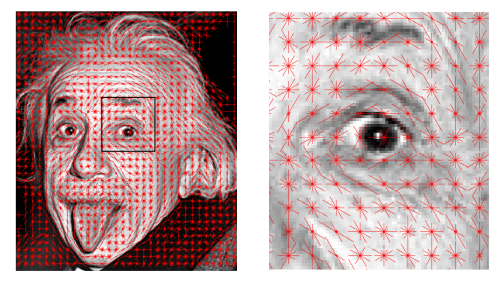
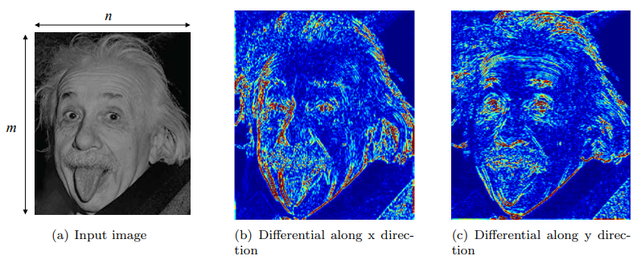
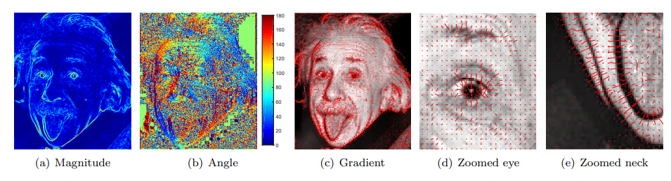
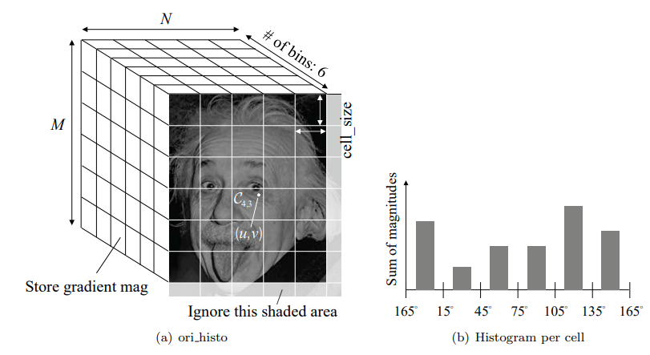
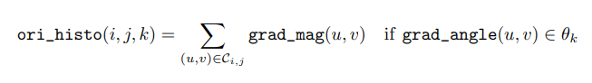
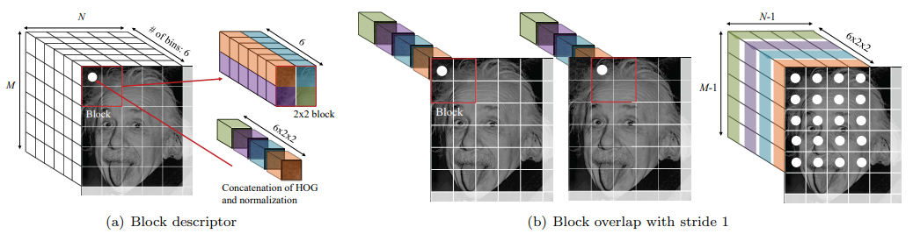
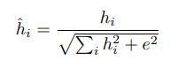
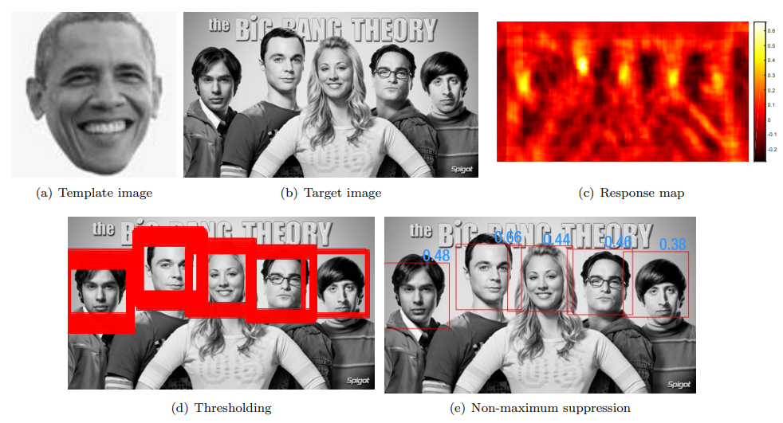
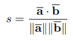
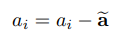

# AI-HOG-FaceDetection
This repository presents a Python implementation of the Histogram of Oriented Gradients (HOG) for face detection. It details the process of image preprocessing, gradient computation, orientation binning, and block normalization, demonstrating HOG's utility in AI-based image processing.

## Instructions
- Run with Python 3.
- Required packages: `numpy`, `matplotlib`, `opencv`.
  - Install numpy & matplotlib: [SciPy](https://scipy.org/install.html)
  - Install OpenCV: [PyPI opencv-python](https://pypi.org/project/opencv-python/)
- Do not use high-level image processing functions like `cv2.filter2D`.

## Histogram of Oriented Gradients (HOG)



*Figure 1: HOG feature visualization for the entire image and the zoomed-in image.*

A variant of HOG (Histogram of Oriented Gradients) in Python proposed by Dalal and Trigg [1] (2015 Longuet-Higgins Prize Winner) is implemented. It had been a long-standing-top representation (until deep learning) for the object detection task with a deformable part model by combining with a SVM classifier [2]. Given an input image, your algorithm will compute the HOG feature and visualize it as shown in Figure 1 (the line directions are perpendicular to the gradient to show edge alignment). The orientation and magnitude of the red lines represent the gradient components in a local cell.

### `extract_hog(im)`
```python
def extract_hog(im):
    # ...
    return hog
```

**Input:** Gray-scale image in uint8 format.  
**Output:** HOG descriptor.  
**Description:** The pseudo-code to compute the HOG descriptor of input image im can be found below:


### Algorithm 1: HOG Descriptor Calculation

1. Convert the gray-scale image to float format and normalize to range [0, 1].
2. Get differential images using `get_differential_filter()` and `filter_image()`.
3. Compute the gradients using `get_gradient()`.
4. Build the histogram of oriented gradients for all cells using `build_histogram()`.
5. Build the descriptor of all blocks with normalization using `get_block_descriptor()`.
6. Return a long vector (`hog`) by concatenating all block descriptors.

## Image filtering


*Figure 2:  (a) Input image dimension. (b-c) Differential image along x and y directions.*

### `get_differential_filter()`
```python
def get_differential_filter:
    # ...
    return filter_x, filter_y
```
**Input:** None.  
**Output:** `filter_x` and `filter_y` are 3x3 filters that differentiate along x and y directions, respectively.  
**Description:** Computes the gradient by differentiating the image along x and y directions. This code will output the differential filters.


### `filter_image(im, filter)`
```python
def filter_image(im, filter):
    # ...
    return im_filtered
```
**Input:** `im` is the grayscale (m x n) image (Figure 2(a)) converted to float format and `filter` is a (k x k) matrix.  
**Output:** `im_filtered` is (m x n) filtered image. Padding with zeros on the boundary of the input image may be necessary for the same size output.  
**Description:** Computes the filtered image using the given image and filter. With the two functions above, generate differential images by visualizing the magnitude of the filter response as in Figure 2(b) and 2(c).

## Gradient computation


*Figure 3: Visualization of (a) magnitude and (b) orientation of image gradients. (c-e) Visualization of gradients at every 3rd pixel (the magnitudes are re-scaled for illustrative purposes.).*

### `f get_gradient(im_dx, im_dy)`
```python
def get_gradient(im_dx, im_dy):
    # ...
    return grad_mag, grad_angle
```
**Input:** `im_dx` and `im_dy` are the x and y differential images (size: m x n).  
**Output:** `grad_mag` and `grad_angle` are the magnitude and orientation of the gradient images (size: m x n). Note that the angle range should be [0, π], i.e., unsigned angle (θ == θ + π).  
**Description:** Compute the magnitude and angle of the gradient from the differential images. This allows visualizing and understanding image contrasts—where the magnitude corresponds to edge strength and the orientation indicates the perpendicular direction to edges, as depicted in Figure 3.

## Orientation binning


*Figure 4:  (a) Histogram of oriented gradients can be built by (b) binning the gradients to the corresponding bin.*

### ` build_histogram(grad_mag, grad_angle, cell_size)`
```python
def build_histogram(grad_mag, grad_angle, cell_size):
    # ...
    return ori_histo
```
**Input:** `grad_mag` and `grad_angle` are the magnitude and orientation of the gradient images (size: m x n); `cell_size` is the size of each cell, a positive integer.  
**Output:** `ori_histo` is a 3D tensor with size M x N x 6 where M = [m/cell_size] and N = [n/cell_size], and `[:]` denotes the round-off operation.  
**Description:** Given the magnitude and orientation of the gradients per pixel, you can build the histogram of oriented gradients for each cell. `ori_histo(i, j, k)` calculates the histogram of gradients within a specific cell `(i, j)` for a given orientation bin `k`.



This function performs a summation of `grad_mag(u, v)` for all `(u, v)` within the cell `C(i, j)` if `grad_angle(u, v)` falls within the range of `θk`.

Angle bins are defined as follows:
- `θ1`: angles between 165° to 180° and 0° to 15°
- `θ2`: angles between 15° to 45°
- `θ3`: angles between 45° to 75°
- `θ4`: angles between 75° to 105°
- `θ5`: angles between 105° to 135°
- `θ6`: angles between 135° to 165°

The resulting histogram is visualized with the magnitude of lines proportional to the histogram values, as illustrated in the referenced figures. The standard `cell_size` is set to 8.


## Block normalization


*Figure 5: HOG is normalized to account for illumination and contrast to form a descriptor for a block. (a) HOG within the (1,1) block is concatenated and normalized to form a long vector of size 24. (b) This applies to the rest block with overlap and stride 1 to form the normalized HOG.*

### `get_block_descriptor(ori_histo, block_size)`
```python
def get_block_descriptor(ori_histo, block_size):
    # ...
    return ori_histo_normalized
```

**Input**: `ori_histo` is the histogram of oriented gradients without normalization. `block_size` is the size of each block (the number of cells in each row/column), which is a positive integer.

**Output**: `ori_histo_normalized` is the normalized histogram with size `(M - (block_size - 1)) x (N - (block_size - 1)) x (6 x block_size^2)`.

**Description**: 
To adjust for lighting and contrast in HOG, perform local normalization by grouping cells into blocks and applying `L2` normalization:

1. Concatenate the HOG within a block to form a descriptor. For `block_size=2`, a 2x2 block will contain `2 x 2 x 6` entries.
2. Normalize the descriptor by dividing each histogram value `h_i` by the square root of the sum of squares of all histogram values in the block plus a small constant `e^2` to prevent division by zero (e.g., `e=0.001`). The normalization equation is:
   
   
   

3. Store the normalized histogram in `ori_histo_normalized`.
4. Move to the next block and repeat the normalization process.

Final `ori_histo_normalized` will be `(M - 1) x (N - 1) x 24`.

## Application: Face Detection


*Figure 6:  (a) A single template image to detect faces in (b) the target image using HOG
descriptors in used. (c) HOG descriptors from the template and target image patches can be compared by using the measure of normalized cross-correlation (NCC). (d) Thresholding on the NCC score will produce many overlapping bounding boxes. (e) Correct bounding boxes for faces can be obtained by using non-maximum suppression.*

```python
def face_recognition(I_target, I_template):
    # ...
    return bounding_boxes
```

**Input:** `I_target` is the image with multiple faces, `I_template` is for face detection.

**Output:** `bounding_boxes` is an n x 3 array `[x_i, y_i, s_i]` per bounding box.

**Normalized Cross-Correlation (NCC):** Score `s` is computed using normalized descriptors `a` and `b`:
   


where `a_i` is the i-th element of descriptor `a`, adjusted to zero mean:  
    



**Description**: Implement face detection using thresholding and non-maximum suppression with an Intersection over Union (IoU) of 50%. Use `visualize_face_detection` for results.

Face detection is implemented using thresholding and non-maximum suppression with an Intersection over Union (IoU) of 50%. For more information on Non-Maximum Suppression and IoU, see these articles:

- [Non-Maximum Suppression](https://towardsdatascience.com/non-maximum-suppression-nms-93ce178e177c)
- [IoU (Intersection over Union)](https://medium.com/analytics-vidhya/iou-intersection-over-union-705a39e7acef)


## Results

For detailed results, including code summaries, visualizations, and findings, please refer to the [Results.md](Results.md) file.


**References**

[1] N. Dalal and B. Triggs, "Histograms of oriented gradients for human detection," in CVPR, 2005.  
[2] P. F. Felzenszwalb, R. B. Girshick, D. McAllester, and D. Ramanan, "Object detection with discriminatively trained part-based models," TPAMI, 2010.