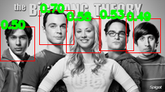

# Code Summaries

## 1. get_differential_filter
This function provides two 3x3 differential filters, filter x and filter y. These filters are known as Sobel filters. filter x detects vertical edges in an image while filter y detects horizontal edges.

## 2. filter_image
This function takes in a grayscale image `im` and a filter matrix `filter`, and produces a filtered image `im_filtered` by convolving the two.

## 3. extract_hog
The function processes the grayscale image `im` to generate its HOG descriptor. It normalizes `im` to `im_float`, calculates x and y gradients `im_dx` and `im_dy`, determines gradient magnitude `grad_mag` and direction `grad_angle`, constructs histograms `ori_histo`, and normalizes and flattens them into the `hog` vector.

## 4. get_gradient
This function calculates the gradient magnitude `grad_mag` using the Pythagorean theorem and gradient angle `grad_angle` for given differential images `im_dx` and `im_dy` using the arctangent function.

## 5. build_histogram
This function constructs a histogram of oriented gradients `ori_histo` for an image, given its gradient magnitudes `grad_mag` and angles `grad_angle`, using cells of a specified size `cell_size`.

## 6. get_block_descriptor
This function normalizes blocks of histogram data from `ori_histo` based on a specified block size `block_size` and returns the normalized histogram, `ori_histo_normalized`.

## 7. face_recognition
This function takes the target image containing potential faces `I_target` and the template image representing a face `I_template` as inputs and produces an `n x 3` array `bounding_boxes` detailing the detected bounding boxes. It first computes the HOG descriptor for `I_template`, normalizes it to have zero mean, and then slides a window of the size of the template over `I_target`, computing the HOG descriptor for each patch and normalizing it similarly. For each patch, the NCC score is calculated. If the score exceeds the threshold `NCC_threshold = 0.49`, the bounding box is stored in `NCC_bounding_boxes`. Then, non-maximum suppression (NMS) is used to filter overlapping boxes based on Intersection over Union (IoU) value.

# Results

The bounding boxes are annotated with their scores, which are the results of NCC calculation representing the similarity between the template and the region inside the bounding box in the target image. Here are the bounding boxes and their scores:

- Bounding Box 1: Score - 0.70
- Bounding Box 2: Score - 0.58
- Bounding Box 3: Score - 0.55
- Bounding Box 4: Score - 0.49

The bounding box with the score 0.70 has the highest similarity with the `template.png` face among all detected regions as it is the closest score to 1. The box with a score of 0.49 has the lowest confidence among the bounding boxes but is still detected as a face as the NCC threshold is set to 0.49.

